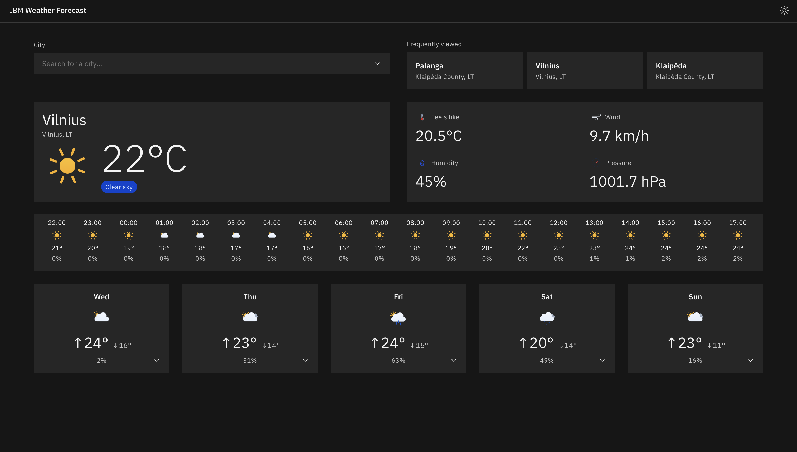

# Weather Forecast App

A responsive weather forecast web app built for the IBM JavaScript
Application Developer internship task.

## Live Demo

[Open live demo](https://weather-forecast-app-production-caa2.up.railway.app/)

[](https://weather-forecast-app-production-caa2.up.railway.app/)

## Features

- Search any city worldwide with autocomplete
- Current conditions: temperature, feels like, wind, humidity, pressure
- 24-hour hourly forecast strip
- 5-day expandable forecast
- Tracks and suggests 3 most-viewed cities
- Dark/light theme toggle
- City selection events logged to console and PostgreSQL

## Stack

- **Frontend:** React, IBM Carbon Design System, SASS
- **Backend:** Node.js, Express
- **Database:** PostgreSQL
- **Weather data:** Open-Meteo
- **Icons:** Meteocons

## Local Development

### Prerequisites

- Node.js 20+
- Docker Desktop

### Setup

```bash
# Install dependencies
cd client && npm install
cd ../server && npm install

# Start PostgreSQL
docker-compose up -d

# Run schema
psql $DATABASE_URL < server/src/db/schema.sql

# Start dev servers (two terminals)
npm run dev:client
npm run dev:server
```

### Environment variables

Copy `.env.example` to `.env` in the server folder:

## Testing

```bash
# Client tests
cd client && npm test

# Server tests
cd server && npm test
```

## Attribution

Weather and geocoding data provided by
[Open-Meteo](https://open-meteo.com/) under CC BY 4.0.
